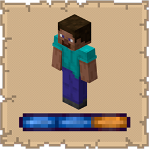

# Player Charge Jump

  

   
A lightweight mod that ports the horse charge jump mechanic directly to the player character.

## Functionality

  

   
Player Charge Jump gives the player the same charged jump ability that horses have. Holding **Shift+Space** begins a charge sequence — a familiar horse-style jump bar appears on the HUD showing your current charge level. Release at the right moment to launch yourself over fences and obstacles that a normal jump can't clear.

- **Tap Space** (without Shift) → standard vanilla jump, unchanged
- **Hold Shift+Space** past the delay → the jump bar appears and starts filling
- **Release in the orange zone** (the sweet spot) → charge jump, clearing fence-height obstacles
- **Overcharge or miss** the sweet spot → the bar shrinks back and you land a standard vanilla jump instead

## Benefits

  

   
- Lets players clear fences and 1.5-block obstacles without building stairs, gates, or relying on horses
- Uses vanilla horse HUD textures — no visual mods or resource packs needed
- No extra keybinds to configure — just hold Shift+Space
- Fully configurable delay and charge speed via Cloth Config and Mod Menu

## Installation

  

   
### Prerequisites
* **Minecraft:** 1.21.10
* **Loader:** [Fabric Loader](https://fabricmc.net/use/installer/) (>=0.18.4)
* **Core Dependencies:**
    * [Fabric API](https://modrinth.com/mod/fabric-api)
    * [Cloth Config API](https://modrinth.com/mod/cloth-config) (Required for configuration)
    * [Mod Menu](https://modrinth.com/mod/modmenu) (Recommended for configuration)

### Steps
1. Download the latest `.jar` from [Modrinth](https://modrinth.com/mod/player-charge-jump) or [CurseForge](https://www.curseforge.com/minecraft/mc-mods/player-charge-jump).
2. Move the file into your Minecraft `%appdata%/.minecraft/mods` folder.
3. Launch the game using the Fabric profile.

## Support

  

   
If you encounter bugs or wish to contribute:
* [Report any problems you find.](https://github.com/armaninyow/Player-Charge-Jump/discussions/categories/issues)
* [Share your ideas for new features.](https://github.com/armaninyow/Player-Charge-Jump/discussions/categories/suggestions)

## Credits

  

   
* **Author**: Armaninyow
* **License**: Released under [CC0-1.0](https://creativecommons.org/publicdomain/zero/1.0/).

