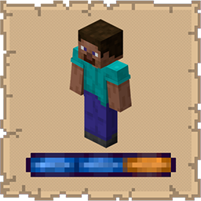

# Player Charge Jump

## Installation

* [Modrinth](https://modrinth.com/mod/player-charge-jump)
* [CurseForge](https://www.curseforge.com/minecraft/mc-mods/player-charge-jump)

## Support
   
If you encounter bugs or wish to contribute:
* [Report any problems you find.](https://github.com/armaninyow/Player-Charge-Jump/discussions/categories/issues)
* [Share your ideas for new features.](https://github.com/armaninyow/Player-Charge-Jump/discussions/categories/suggestions)

## Changelog

  

   
### 3.1.0—1.21.x
* Split 1.21.5-1.21.11 into two separate version ranges to account for API differences across minor versions
* Merged 1.21.2-1.21.5 into a single version range due to shared rendering API compatibility
### 3.0.0—1.21.x
* Added multi-version support covering Minecraft 1.21 through 1.21.11
### 2.0.0—1.21.11
* Updated to Minecraft 1.21.11
* Added 15-tick linger phase that keeps the jump bar visible and frozen at its release fill width after Shift+Space is released, regardless of outcome
### 1.1.0—1.21.10
* Added Server-side opt-in. The charge jump now requires the mod to be installed on the server. On vanilla servers the mod is silently disabled and the game behaves exactly as normal. This ensures fair multiplayer play
### 1.0.0—1.21.10
* Initial Release

